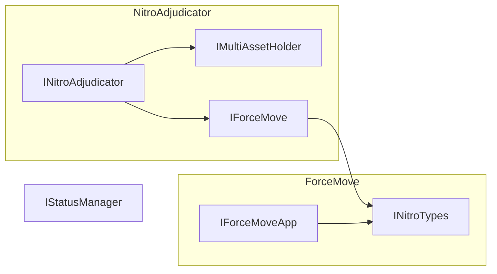

# ERC-7824 Reference Implementation

This repository is a reference implementation of [ERC-7824](./erc-7824.md), providing a framework for off-chain state channels with built-in dispute resolution and asset management. It features:

• Core interfaces for channel definitions and dispute resolution (INitroAdjudicator, IForceMove, IMultiAssetHolder, etc.)  
• Example usage of Nitro-based state channels  
• An optional application pattern (e.g., CountingApp) demonstrating how to extend the framework  

## Architecture Overview

Below is a high-level diagram of how the interfaces in this repository relate to one another:



Note:  
• INitroAdjudicator extends IForceMove & IMultiAssetHolder.  
• IForceMove and IForceMoveApp rely on the data types in INitroTypes.  
• IStatusManager provides status-tracking (e.g., channel lifecycle).  

## Foundry Usage

This project uses Foundry (a fast and portable toolkit for Ethereum application development written in Rust).

• Forge → build, test, and manage your Solidity projects (similar to Truffle, Hardhat, or DappTools).  
• Cast → Swiss army knife for interacting with on-chain data.  
• Anvil → Local Ethereum node (similar to Ganache or Hardhat Network).  
• Chisel → Fast and verbose Solidity REPL.

Below are common commands:

### Build and test
```bash
forge build
forge test
```

## Contributing

Contributions, issues, and pull requests are welcome! Feel free to explore, experiment, and extend this framework to suit various off-chain state channel use cases.

## License

All code is released under an MIT open-source license. See LICENSE for details.
